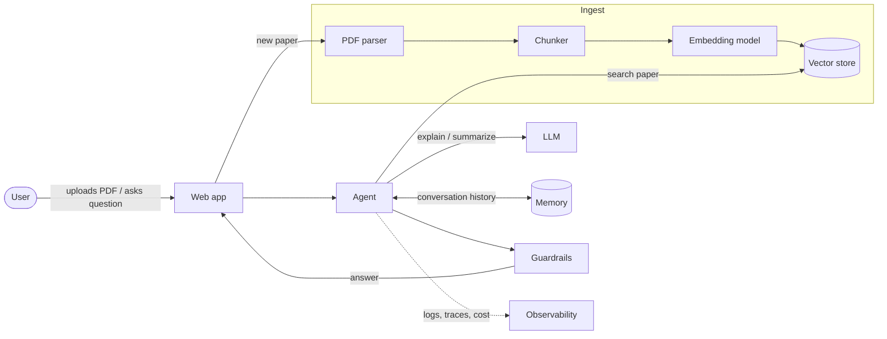

# Capstone: Research Paper Summarizer

You upload a research paper (PDF). The agent parses it, indexes it with embeddings and
vector search (RAG), and explains it in simple terms — remembering what you have
already asked about.

<!-- TODO: Mari — demo screenshot or GIF of the finished app -->

## Architecture

## What gets added each day

| Day | You add | Result at the end of the day |
|-----|---------|------------------------------|
| [Day 1](day1.md) | LLM client, prompts, retries, structured output | Summarize a pasted abstract reliably |
| [Day 2](day2.md) | PDF parsing, chunking, embeddings, vector search | Ask questions about a whole uploaded paper |
| [Day 3](day3.md) | Agent loop, tools, memory, guardrails | Multi-turn explanations that remember context |
| [Day 4](day4.md) | Web UI, logging, evaluation, deployment | A shareable demo you can operate |

<!-- TODO: Mari — adjust once day topics are final -->

## Sample papers

Use the open-access papers listed in the repository's
[`sample_papers/` README](https://github.com/mari-muthu-k/agent-to-production/tree/main/sample_papers),
or bring your own CS/AI paper from arXiv.

!!! warning "Production"
    Only upload papers you are allowed to share with a third-party API. Don't upload
    confidential or unpublished documents to a free-tier provider.

## Stretch goals

<!-- TODO: Mari -->

- Compare two papers side by side.
- Cite the page and section for every claim in the explanation.
- Generate a glossary of the paper's key terms.
